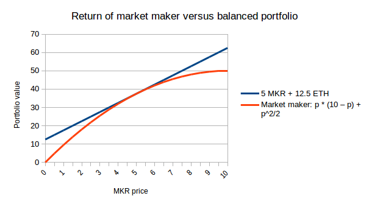

## Notes

- flawed Bancor's model where they calculate in the open the buy/sell price of a coin. In a scenario
  of dramatic fluctations, Bancor will trail the market sentiment and dig into its reserves to
  compensate its users.
- instead using the path independence property which shows that the # of buys are counterbalanced by
  sells, buy and sell as function of single dimension p (say current price ratio). 
  for eg, trading between MKR vs ETH, we can have mkr_bal(p) = 10 - p and eth_bal(p) = integral of p
  = p^2/2. This function is satisfied with different buy and sell orders as long as the balances
  match up. With p going from 5 to 4, mkr_bal(4) - mkr_bal(5) = 1 and eth_bal(4) - eth_bal(5) =
  -4.5. 
- stops "reserve bleeding" as market returns to equilibrium.
- underperforms just holding the balances but minimized if price stays stable. AMMs can earn revenue
  by changing (1 + x)p and (1 - x)p on buys and sells respectively as commission for trades. This
  works well if prices fluctuate a lot.

  
- constant reserve mechanism maintaining the invariant tokenA_bal(p).tokenB_bal(p) = k for constant k.
  
  tokenA_bal(p) = sqrt(k.p)
  tokenB_bal(p) = sqrt(k/p)

- problem of arbitrage between rapid price movements by allowing opportunitistic traders to bid
  against each other in an auction.